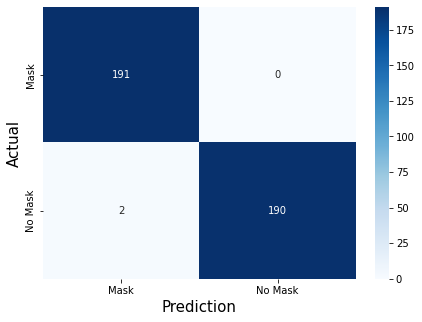
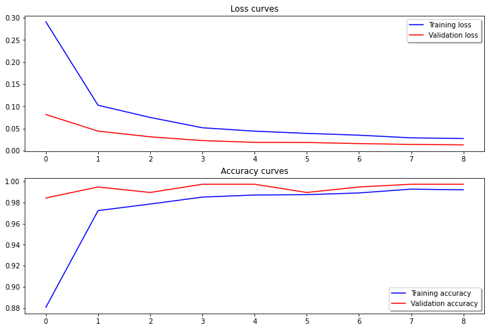
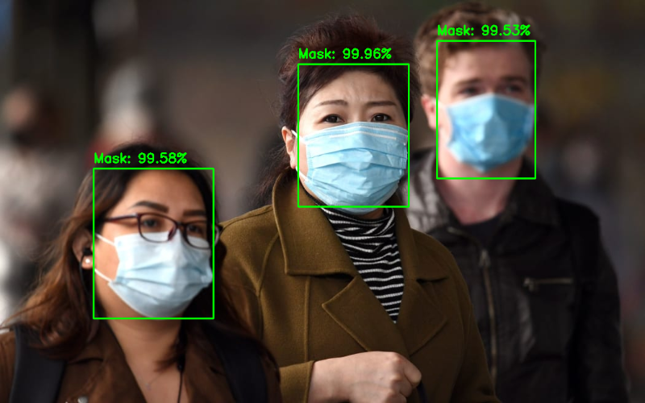
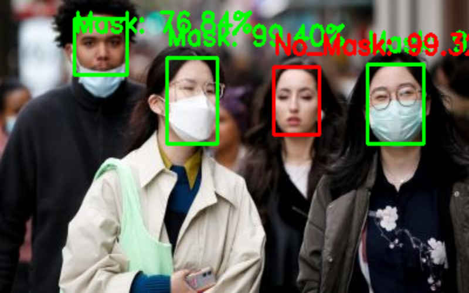

# Face-Mask-Detection
Real time face mask detection applying Computer Vision and OpenCV's dnn module with a pre-trained caffemodel to detect faces

## Confusion matrix
From the test set, the number of images that had a good prediction in face detection was observed to determine whether the face was wearing a mask

## Loss and Accuracy Graphs vs. Iterations

## Face detection
Some samples from random images

